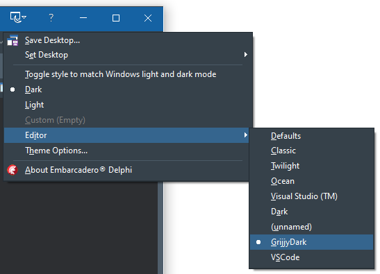

# Alternative Dark Editor Themes for Delphi 10.2.2 and Later

Here you will find some alternative editor color schemes, as presented in our blog post "[Alternative Dark Editor Themes for Delphi 10.2.2](https://blog.grijjy.com/2017/12/29/alternative-dark-editor-themes-for-delphi-10-2-2/)".

## To install for Delphi 10.4

Delphi 10.4 changed the way editor themes are handled. You can now create multiple custom editor themes and change between them on the fly. Unfortunately, you cannot use the migration tool anymore to install the themes. Instead, you need to import a file into the registry editor:

* Shut down the Delphi IDE.
* Double-click on the `Delphi10.4.reg` file in this repository.
* This will show a warning saying importing registry files can be dangerous. Ignore this and select `Yes`.

This will install both a `GrijjyDark` theme and a `VSCode` theme. When you start the IDE, it will default to the `GrijjyDark` theme. You can easily switch to other themes using the Theme button in the caption bar:

## To install for Delphi 10.2.2 through 10.3.x

- Shut down the Delphi IDE.
- Run `migrationtool.exe`, which you can find in the `c:\Program Files (x86)\Embarcadero\Studio\19.0\bin\` directory of your Delphi installation.
- Choose the option "Import settings from a migration file" and browse for one of the theme files (with an `.idesettings` extension) .
- On the next page, accept the defaults (to import all settings).
- On the page after that, select the IDE version you want to import the settings into. You should *only* select version 10.2 (with update 2) or later, since the theme isn't designed for earlier Delphi versions.
- Finish the wizard.